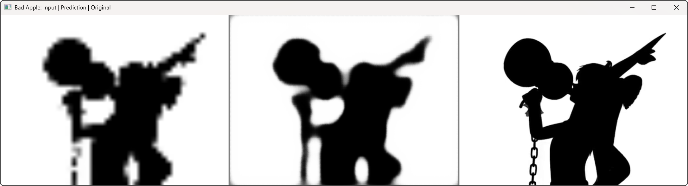
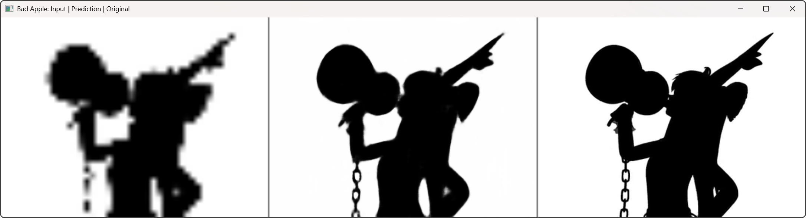

<div align="center">
  
[](https://www.python.org/)
[](https://pytorch.org/)
[](https://opencv.org/)

</div>

# 🍎 Bad Apple - Neural Networks 🧠

<div align="center">


<div style="display: flex; justify-content: space-between; max-width: 724px; text-align: center; margin: 0 auto;">
  <span style="flex: 1;">input</span>
  <span style="flex: 1;">AI-upscaled</span>
  <span style="flex: 1;">original frame</span>
</div>

</div>

## 🌟 Project Overview

This project uses **Neural Networks** to upscale and recreate "Bad Apple!!". The neural network is trained to transform low-resolution frames into higher resolution versions, allowing for playback of the video using AI-upscaled frames.

<div align="left">
  
### 📋 Pipeline Components

</div>

This repository contains a complete pipeline for:
1. 🎬 Converting video frames to features
2. 🔄 Training a custom neural network model
3. ▶️ Using the model to play the upscaled video

## 📦 Requirements

<details>
<summary><b>Click to expand package list</b></summary>

```
matplotlib==3.10.5
numpy==2.2.6
opencv-python==4.12.0.88
pandas==2.3.1
scikit-learn==1.7.1
torch==2.7.1+cu128
torchvision==0.22.1+cu128
```
</details>

## 🧩 Components

<div align="center">
  
### 🔍 Data Preparation
  
</div>

<table>
  <tr>
    <td><code>datasetGenerator.py</code></td>
    <td>Converts the original Bad Apple video into low-resolution and high-resolution frame pairs, saving them as CSV data for model training.</td>
  </tr>
</table>

<div align="center">
  
### 🧪 Model Training
  
</div>

<table>
  <tr>
    <td><code>customModel.py</code></td>
    <td>Contains the neural network architecture (CNN with residual blocks and upsampling layers)</td>
  </tr>
  <tr>
    <td><code>trainCustomModel.py</code></td>
    <td>Trains the model with the prepared data, saving the trained model for later use</td>
  </tr>
</table>

<div align="center">
  
### 🎬 Playback and Testing
  
</div>

<table>
  <tr>
    <td><code>AiVideoPlayer.py</code></td>
    <td>Loads the trained model and plays back the Bad Apple animation by upscaling low-resolution frames</td>
  </tr>
</table>

## 🔍 How It Works

<div align="left">
  
</div>

> The original video is processed into pairs of low-resolution (48x36) and high-resolution (480x360) frames

<div align="left">
  
</div>

> A convolutional neural network with residual blocks and upsampling layers learns to map low-res to high-res

<div align="left">
  
</div>

> The model is trained on thousands of frame pairs to minimize the difference between predicted and actual high-res frames

<div align="left">
  
</div>

> The trained model takes low-resolution frames as input and generates high-resolution outputs in real-time

## 🚀 Usage

<div align="left">
  
### 1️⃣ Install Requirements
  
</div>

```bash
pip install -r requirements.txt
```

<div align="left">
  
### 2️⃣ Prepare the dataset
  
</div>

```bash
python datasetGenerator.py
```

<div align="left">
  
### 3️⃣ Train the Model
  
</div>

```bash
python trainCustomModel.py
```

<div align="left">
  
### 4️⃣ Use the Model
  
</div>

```bash
python AiVideoPlayer.py
```

## 🧮 Model Details

<table>
  <tr>
    <th colspan="2" align="center">CNN Architecture Components</th>
  </tr>
  <tr>
    <td>🔄 <b>Residual Blocks</b></td>
    <td>Preserve features through deep layers</td>
  </tr>
  <tr>
    <td>📈 <b>Pixel Shuffle Upsampling</b></td>
    <td>Increase resolution efficiently</td>
  </tr>
  <tr>
    <td>🔍 <b>Bilinear Interpolation</b></td>
    <td>Enable precise resizing</td>
  </tr>
</table>

The training process uses **MSE loss** and **Adam optimizer** to learn the mapping between low and high resolution frames.

## 📊 Training Progress

### Loss and Accuracy curves

<div align="center">


</div>

---

### Comparison between the first and best training epochs:


<div align="center">




<div style="display: flex; justify-content: space-between; width: 100%; text-align: center; margin: 0 auto;">
  <span style="flex: 1;">input</span>
  <span style="flex: 1;">AI-upscaled</span>
  <span style="flex: 1;">original frame</span>
</div>

---

</div>

The comparison shows notable model improvements. The first epoch yields a blurry, pixelated upscaled frame with indistinct features like the chain and even the face, resembling the low-res input.

By the best epoch, the image gains sharp edges and clear details, the model is able to reconstruct chain links and facial features based off almost no information.