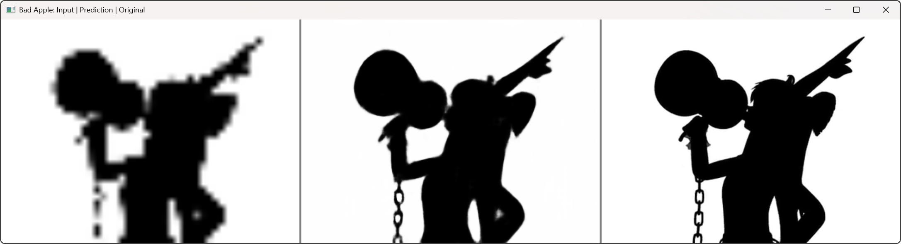

# Bad Apple with Neural Networks

*Side-by-side comparison showing input (left), AI-generated frame (middle), and original frame (right)*

This project uses neural networks to upscale and recreate the famous "Bad Apple!!" animation. The neural network is trained to transform low-resolution frames into higher resolution versions, allowing for playback of the video using AI-generated frames.

## Project Overview

This repository contains a complete pipeline for:
1. Converting video frames to feature vectors
2. Training a neural network model
3. Using the model to play the upscaled video

## Components

### Data Preparation
- `videoTofeatures.py`: Converts the original Bad Apple video into low-resolution and high-resolution frame pairs, saving them as CSV data for model training.

### Model Training
- `customModel.py`: Contains the neural network architecture (CNN with residual blocks and upsampling layers)
- `trainCustomModel.py`: Trains the model with the prepared data, saving the trained model for later use

### Playback and Testing
- `AiVideoPlayer.py`: Loads the trained model and plays back the Bad Apple animation by upscaling low-resolution frames
- `progressBar.py`: Helper utility for displaying progress during training and processing

## How It Works

1. **Frame Processing**: The original video is processed into pairs of low-resolution (24x18) and high-resolution (120x90) frames
2. **Model Architecture**: A convolutional neural network with residual blocks and upsampling layers learns to map low-res to high-res
3. **Training**: The model is trained on thousands of frame pairs to minimize the difference between predicted and actual high-res frames
4. **Playback**: The trained model takes low-resolution frames as input and generates high-resolution outputs in real-time

## Usage

1. **Prepare the dataset**:
   ```
   python videoTofeatures.py
   ```

2. **Train the Model**:
   ```
   python trainCustomModel.py
   ```

3. **Use the Model**:
   ```
   python AiVideoPlayer.py
   ```
   
## Model Details

The model uses a convolutional neural network architecture with:
- Residual blocks to preserve features through deep layers
- Pixel shuffle upsampling to increase resolution
- Bilinear interpolation for precise resizing

The training process uses MSE loss and Adam optimizer to learn the mapping between low and high resolution frames.